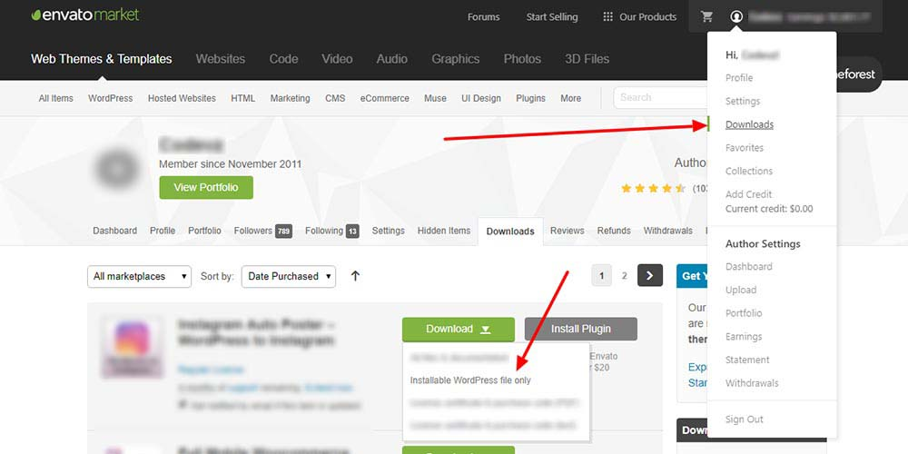
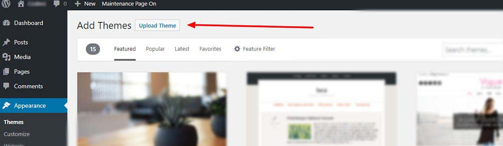
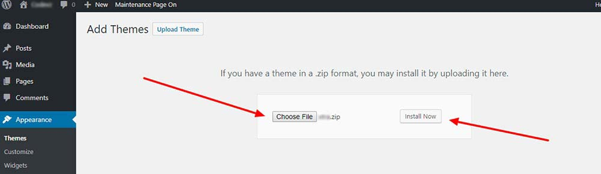
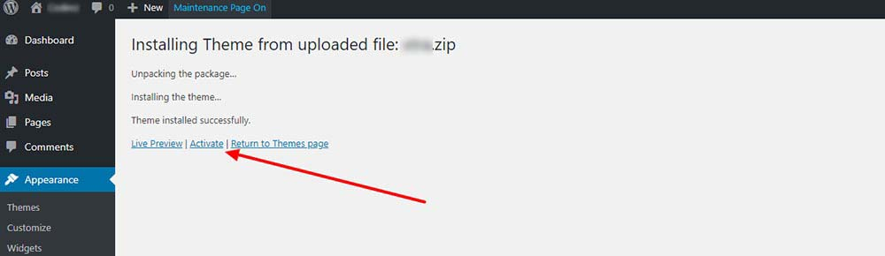

# Theme Installation



##  Theme Installation Via Admin Panel 

First of all, you need to download the theme installable file from your account that purchased item, go to your **ThemeForest Account &gt; Downloads Tab**

Now go to your site **Dashboard &gt; Appearance &gt; Themes** and click on Add New Theme like below

Now click on **Upload Theme**

Choose the zipped file that you have **Downloaded from ThemeForest** and click on **the Install** button, then wait for the installation process

Final step click on **Activate** theme




## Theme Installation Via FTP

If you can’t install the theme via method 1, So try this way:

* Log in to your server via your **FTP** software \( FileZilla, Transmit, etc \)
* Unzip the **saasland.zip** file, ONLY use the extracted theme folder.
* Upload the extracted theme folder into **wp-content &gt; themes**
* Activate the newly installed theme by going to **Appearance &gt; Themes**
* Go to **Appearance &gt; Install Plugins** and install all required plugins
* Simply click the **Install** button on each plugin to install them
* Done



 

 

 

 

